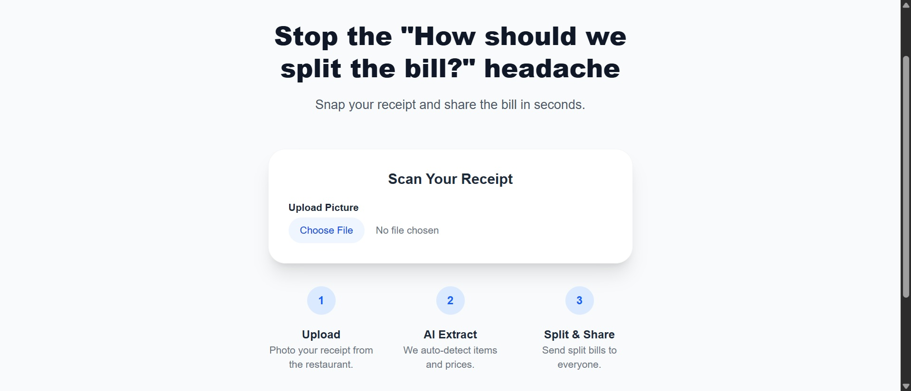
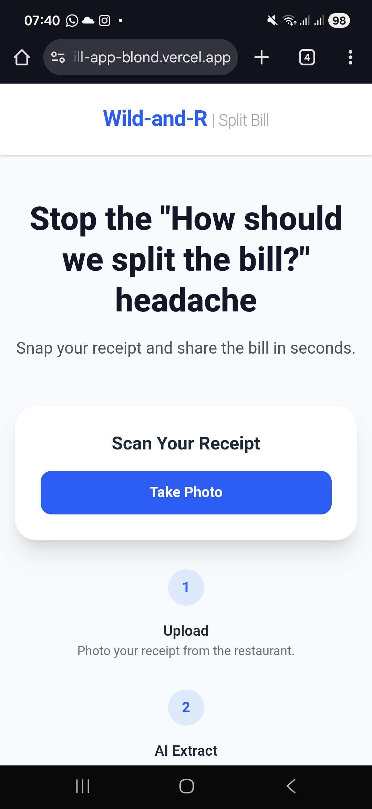
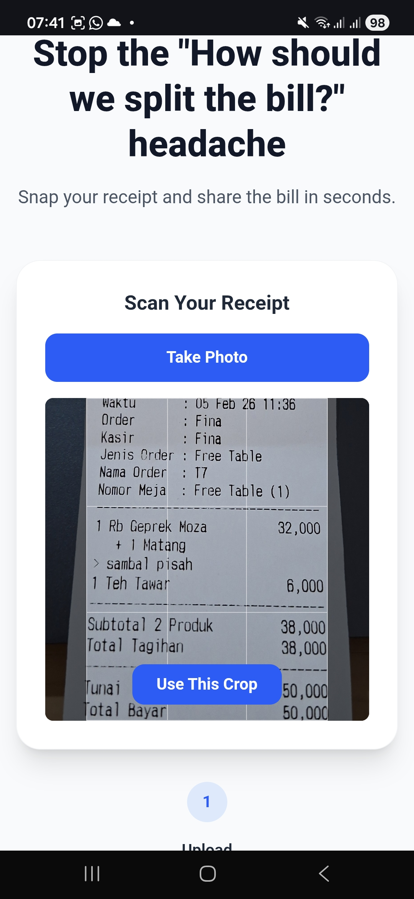
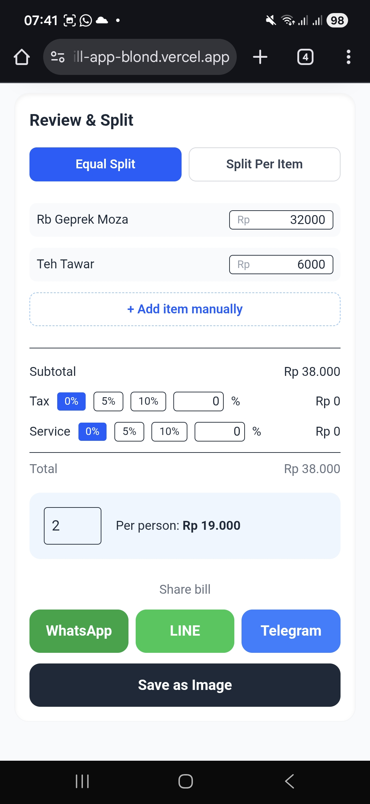

## About This App

This is an app to split bills when you're eating out with your friends or family. Simply snap a picture with your phone and the app will calculate the split bill, either by splitting equally or by splitting per item. You can also use a desktop to upload the bill image if you went home and realized the bill should have been split instead of paying for it alone!

## Tech Stack Used
This project uses: 
1. Next.js 16 for routing, API route, client components and server route for API calls. 
2. React 19 for items, split logic and cropping UI.
3. Tailwind CSS v4 for styling.
4. react-easy-crop for mobile camera photos and manual cropping, output is Canvas-based.
5. Canvas API for cropping and generating "Saved as Image" split bill summary.
6. Tesseract.js for OCR with english + indonesian languages.
7. Google gemini-2.5-flash for structuring OCR into JSON item and price.
8. TypeScript for tooling.

## How to get started

Simply open up the deployed website listed below, snap a picture if you're in mobile or upload an image if in desktop, let the AI analyze it, decide to split equal or per item, then share it with the people you ate with.

## Deployed on Vercel

This app is deployed on Vercel

https://split-bill-app-blond.vercel.app/

## Screenshots
The App in Desktop

The App in Mobile

After taking a photo

Equal Split

Split per Item

